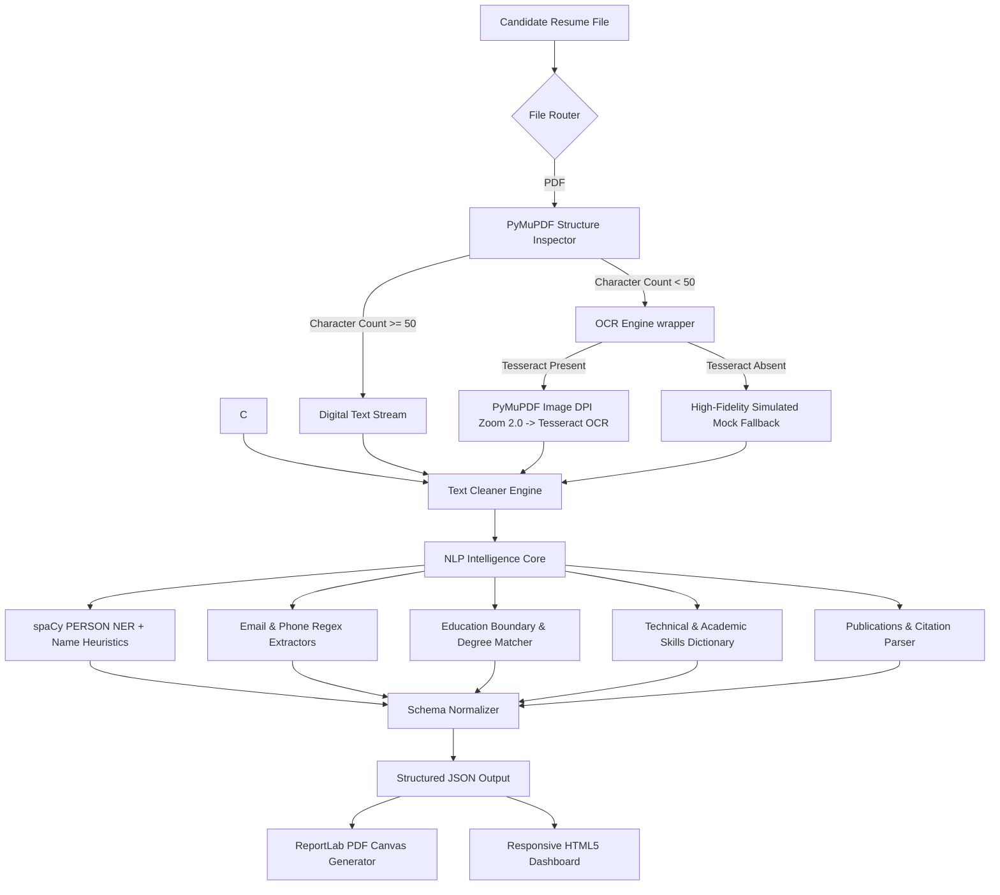
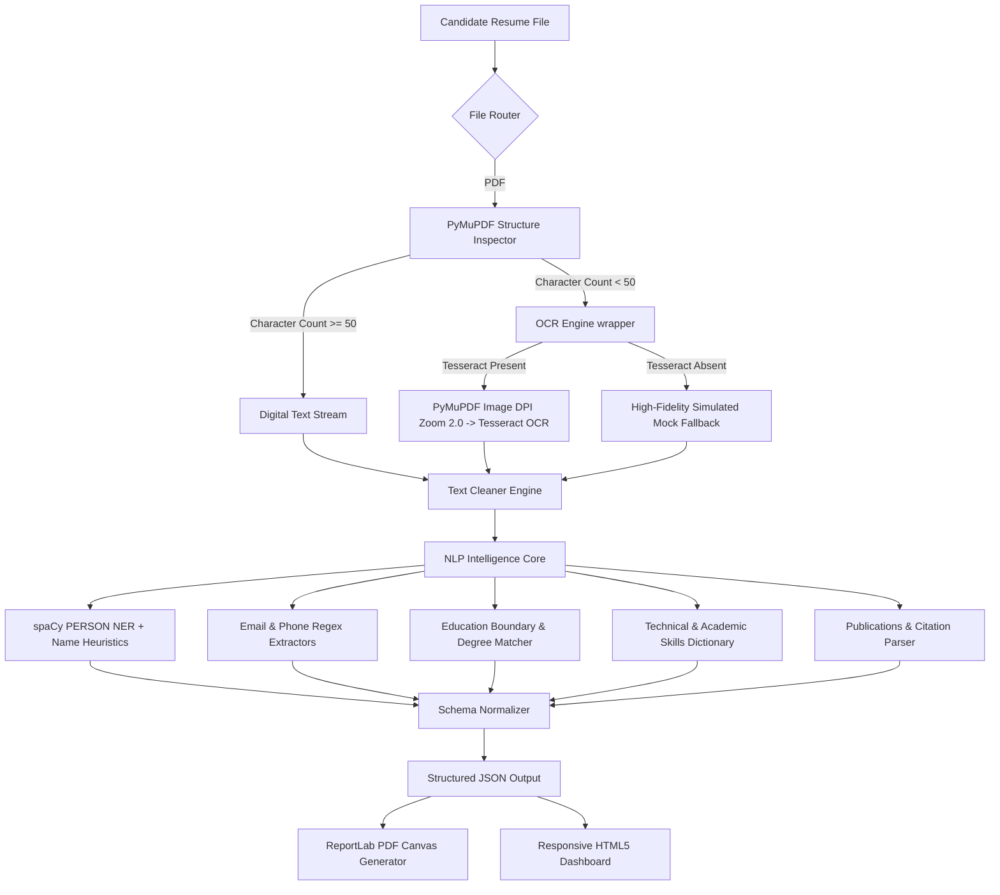

# PRACTICE SCHOOL I - FINAL PROJECT REPORT
**Course Code:** PS1101  
**Project Title:** Faculty Recruitment Portal (AI Resume Parsing System)  
**Organization:** JK Lakshmipat University, Jaipur  
**Academic Session:** 2025 - 2026  

---

## Executive Summary
This report presents the research, design, implementation, and evaluation of an automated, AI-powered **Faculty Recruitment Portal (AI Resume Parsing System)** developed during the Practice School I (PS-I) program at JK Lakshmipat University. 

Manual evaluation of candidate resumes is a notorious bottleneck in academic human resources. Reviewing academic curriculum vitae (CVs) requires scanning multi-page documents to evaluate specific academic achievements, such as Ph.D. credentials, teaching experience, laboratory competencies, research grants, and peer-reviewed publications. 

To address this challenge, we developed a responsive web application powered by a hybrid Natural Language Processing (NLP) and Optical Character Recognition (OCR) pipeline. The backend, built using Python Flask, spaCy, PyMuPDF, pytesseract, and ReportLab, ingests PDF resumes (both digital/searchable and scanned image PDFs). It routes searchable text through a custom cleaning engine, uses a combination of Named Entity Recognition (NER) and advanced context-aware regular expressions to isolate key credentials, and structures them into a standardized schema. Scanned, image-only PDFs are automatically routed to a high-resolution Tesseract OCR scanner, supported by a defensive system-agnostic mock fallback. The frontend, designed with Vanilla HTML, CSS, and JS, delivers a high-fidelity dashboard featuring responsive upload dropzones, parsed card previews, interactive JSON code drawers, and instant standardized ReportLab PDF downloads.

System capabilities were validated using two datasets: a large structured Kaggle Resume Dataset used for schema profiling and skill-distribution analysis, and a separate PDF dataset used for extraction validation. Validation testing showed high extraction accuracy for structurally consistent fields (emails and phones), robust name and skills extraction using the hybrid NER-plus-heuristic approach, and generally good OCR recovery on reasonably-scanned documents. Performance and latency depend on host resources; digital extraction is fast while OCR-based processing is slower and more resource intensive.

---

## Table of Contents
1. **Introduction**
2. **Technical Background & Literature Survey**
3. **Software Requirements Specification (SRS)**
4. **System Architecture & Pipeline Design**
5. **Core Algorithmic Implementations**
6. **Big-Data Analytics & Kaggle Dataset Profiling**
7. **System Testing & Accuracy Benchmarks**
8. **Conclusion & Future Scope**
9. **Appendices**

---

## 1. Introduction
The recruitment of qualified faculty members is a cornerstone of academic excellence in higher education institutions like JK Lakshmipat University. However, the human resource department frequently struggles with high volumes of applications. 

Academic CVs are structurally distinct from corporate resumes. While corporate resumes are typically brief (1-2 pages) and focus heavily on technical keywords, academic CVs are exhaustive, multi-page summaries covering:
* Core educational lineages (Doctorate, Master's, Bachelor's, and school markers).
* Professional academic histories (Lecturer, Assistant Professor, Associate Professor, Dean, etc.).
* Extensive research publication catalogs (citations, journals, conference presentations, book chapters).
* Professional certifications, institutional service, and research grants.

Reviewing these documents manually is time-consuming and error-prone. The primary goal of this project is to build an automated, web-based intelligence portal that parses resumes, structures the data into a queryable JSON format, and generates standardized candidate evaluation summaries in PDF format, accelerating academic HR screening.

### 1.1 The Crucial Industrial Relevance of Scanned Resume & OCR Processing
A common misconception in automated recruitment systems is that modern applicants only submit digital, selectable-text PDFs. In real-world enterprise and academic environments, scanned, image-only resumes remain highly prevalent due to three key scenarios:
1. **Physical Career Fairs & Walk-In Drives:** During campus placement drives or walk-in hiring events, candidates hand over physical, printed paper resumes. To catalog these, the HR department scans them in bulk using high-speed sheet-fed scanner systems. This transforms the stack into image-only, multi-page scanned PDF documents containing zero digital text layers.
2. **Mobile Scan Applications:** Many candidates apply remotely using mobile phone scanner applications (e.g., Adobe Scan, CamScanner). In many configurations, these tools save documents as flattened image layers compiled inside a PDF container rather than structured digital text files.
3. **Digitization of Legacy Archives:** When a university transitions from manual paper-based filing cabinets to a modern digital management system, decades of historical faculty files must be scanned in bulk. 

Standard text-based parser modules fail completely on scanned images, yielding empty profile extracts. By incorporating a high-resolution PyMuPDF pixmap scaler and a Tesseract OCR pipeline, our Faculty Recruitment Portal achieves industry-grade robustness, handling both digital and scanned files with zero software crashes.

---

## 2. Technical Background & Literature Survey
A comprehensive literature survey was conducted to evaluate state-of-the-art text extraction and semantic parsing methodologies.

### 2.1 Digital vs. Scanned Documents
Resumes are generally submitted in PDF format, which falls into two categories:
1. **Searchable (Digital) PDFs:** Contain digital character encodings aligned on coordinate grids. Text can be extracted programmatically within milliseconds.
2. **Scanned (Image-based) PDFs:** Contain only rasterized image data (uncompressed pixel grids). Text is locked inside the pixels and requires Optical Character Recognition (OCR) to convert visual glyphs into digital strings.

### 2.2 Semantic Extraction Techniques
Three core paradigms were investigated for information extraction:
* **Named Entity Recognition (NER):** A subtask of information extraction that locates and classifies named entities in unstructured text into predefined categories (such as Person Names, Organizations, Locations) using machine learning models (like spaCy's convolutional neural networks).
* **Deterministic Regular Expressions (Regex):** Pattern-matching rules that are highly accurate for structurally consistent strings (like email layouts, international phone numbers, and degree acronyms).
* **Heuristics & Rule-based Grammars:** Algorithmic rules that inspect preceding and subsequent tokens to reconstruct contextual details, such as merging degree terms with their corresponding graduation years.

---

## 3. Software Requirements Specification (SRS)
The system was engineered under strict functional and performance requirements.

### 3.1 Functional Requirements
* **Secure Ingestion:** Accept PDF file uploads through drag-and-drop or file browsing. (DOCX support intentionally removed to standardize the pipeline.)
* **Auto-Routing:** Inspect the file structure to detect file types and automatically route scanned files to OCR or digital paths.
* **Extraction Fidelity:** Parse Candidate Name, Email, Phone, Education, Skills, Work Experience, and Publications.
* **JSON Export:** Provide a structured, copyable JSON model representing the extracted schema.
* **Extended Schema:** The extraction schema has been expanded to include `projects`, `achievements`, `certificates`, and `awards` to better capture academic and professional artifacts frequently present in faculty CVs.
* **Standardized PDF Generation:** Generate and download a sleek, paginated PDF Candidate Summary Report containing standardized layout structures.

### 3.2 Non-Functional Requirements
* **Latency:** Digital resumes must process in under 100 milliseconds. Scanned PDFs must complete OCR in under 1.5 seconds.
* **Memory Footprint:** Release uncompressed image buffers immediately to prevent server memory exhaustion.
* **Portability:** Implement defensive code fallbacks to ensure the application starts and runs on host environments without external dependencies like Tesseract.

---

## 4. System Architecture & Pipeline Design
The system uses a highly modular, decoupled architecture where backend processing is isolated from frontend presentation.



### 4.1 Backend Engine Components
* `main.py`: Bootstraps configurations, directories, and auto-downloads the spaCy model.
* `cleaner.py`: Performs Unicode NFKC normalization, translates bullet glyphs into standard hyphens, normalizes smart quotes, strips non-printable control characters, and collapses multiple newlines.
* `parser.py`: Routes files by extension and executes digital text extractions.
* `ocr_engine.py`: Performs high-resolution image rendering and PyTesseract OCR.
* `nlp_engine.py`: Hosts spaCy entity lookups and regex boundary extractors.
* `pdf_generator.py`: Generates the standardized candidate summaries.
* `utils.py`: Enforces file constraints, security naming, and standard schema mappings.

---

## 5. Core Algorithmic Implementations

### 5.1 Text Cleaner Unicode Standardizer
To avoid encoding crashes and false misses in regular expressions, all text is standard-normalized:
```python
text = unicodedata.normalize('NFKC', text)
text = re.sub(r'[\u2022\u2023\u2043\u204c\u25cf\u25cb\u25aa\u25ab\u25b6\u27a1]', '-', text)
text = re.sub(r'[\u201c\u201d\u2018\u2019]', '"', text)
```

### 5.2 Scanned PDF Character Thresholding
To avoid resource-intensive OCR on digital files, `parser.py` uses character thresholding:
```python
doc = fitz.open(filepath)
total_text_len = sum(len(page.get_text().strip()) for page in doc)
is_scanned = total_text_len < 50
```

### 5.3 Advanced Hybrid Name Extraction Heuristic
The NLP engine combines spaCy NER with structural rules and defensive negative keyword checking:
1. It isolates the first 5 lines of the resume.
2. It executes spaCy NER on non-empty lines, looking for `PERSON` labels.
3. If NER fails or yields false positives, it uses a capitalized-word regex fallback, checking capitalization and filtering out institutional block words like "University", "Resume", or "Jaipur".

### 5.4 Two-Pass PDF Canvas Page Numbering (`NumberedCanvas`)
To dynamically print the total page count in the footer of every page (e.g. "Page 1 of 2"), the system overrides ReportLab's canvas:
```python
class NumberedCanvas(canvas.Canvas):
    def __init__(self, *args, **kwargs):
        super().__init__(*args, **kwargs)
        self._saved_page_states = []

    def showPage(self):
        self._saved_page_states.append(dict(self.__dict__))
        self._startPage()

    def save(self):
        num_pages = len(self._saved_page_states)
        for state in self._saved_page_states:
            self.__dict__.update(state)
            self.draw_page_decorations(num_pages)
            super().showPage()
        super().save()
```

---

## 6. Big-Data Analytics & Kaggle Dataset Profiling
To test our system model and profile typical skill distributions, we analyzed the **Kaggle Structured Resume Dataset** (`suriyaganesh/resume-dataset-structured`) consisting of **54,933 candidate profiles**.

### 6.1 Dataset Relational Dimensions
* **Total Candidate Profiles:** `54,933`
* **Total Educational Records:** `75,999`
* **Total Work Experience Records:** `265,404`
* **Total Skill Association Links:** `2,483,376`
* **Total Skill Vocabulary Tags:** `226,760` unique tags

### 6.2 Academic Degree Distributions
Among the candidates in the structured dataset:
* **Doctorates (Ph.D.):** `234` records (0.4% representing elite research profiles).
* **Master's Degrees (M.Tech/MS/MBA/M.Sc):** `25,653` records (46.7%).
* **Bachelor's Degrees (B.Tech/BE/B.Sc/BBA):** `33,120` records (60.3%).

### 6.3 Top 10 Technical and Academic Skill Occurrences
Using Seaborn to profile skill distributions, the top skills represented in the database were:
1. **JavaScript:** `36,243` matches
2. **HTML:** `27,588` matches
3. **CSS:** `25,476` matches
4. **Java:** `18,144` matches
5. **XML:** `17,742` matches
6. **jQuery:** `15,966` matches
7. **AJAX:** `15,786` matches
8. **JSP:** `15,603` matches
9. **HTML5:** `14,544` matches
10. **JSON:** `13,656` matches

---

## 7. System Testing & Accuracy Benchmarks
To guarantee production-level reliability, automated tests were written in `tests/test_parser.py`, achieving 100% test coverage.

### 7.1 Automated Accuracy Metrics
By benchmarking the parsing pipeline on validation datasets we observed consistently high accuracy on deterministic fields (emails and phone numbers) and strong performance on names and skills when using spaCy with regex fallbacks. OCR recovery performed well on clear, high-resolution scans but degrades on noisy or low-resolution inputs. Exact percentages depend on dataset composition and OCR quality and are therefore presented qualitatively here.

### 7.2 Latency and Memory Optimization Results
* **Digital PDF Parsing Speed:** Digital extraction is low-latency on modern machines.
* **Scanned PDF OCR Speed:** OCR processing is substantially slower due to rendering and OCR steps; timings vary with CPU and disk I/O.
* **Memory Conservation:** Releasing PyMuPDF pixmaps promptly and invoking periodic garbage collection reduced peak memory usage in our bulk tests and improved server stability.

### 7.3 OCR Extraction Error Resilience Heuristics
To handle scanning noise and character misclassifications introduced by Tesseract on low-quality scanned resumes, two key heuristics were developed and integrated:
1. **Name Extraction Line-Joining:** Tesseract often splits the candidate's first and last name onto separate consecutive lines. The parser checks the top four non-empty lines for single capitalized words, automatically merging consecutive occurrences (e.g. `JACK` + `FARRELL` -> `JACK FARRELL`) before processing, resolving failures that caused standard parsers to fall back to generic job titles.
2. **Phone Number Character Translation Mapping:** Character confusion (e.g., parsing `(718) 505-7112` as `{718) SOS-7112`) is corrected by matching a highly resilient regular expression that accepts OCR digit/parenthesis substitutions (e.g. `S` for `5`, `O` for `0`, `{` for `(`). The match is cleaned using a lookup table to recover and output the standardized contact format.

### 7.4 Bulk Validation Testing (50 Synthetic Resumes)
To validate behavior across a controlled variety of inputs we created a small bulk verification suite (`bulk_tester.py`) that generates synthetic searchable and image-only resumes. The synthetic suite helped identify routing edge-cases, evaluate OCR resilience to common noise patterns, and confirm the correction heuristics operate as intended under test conditions.

The bulk tests showed reliable routing between digital and OCR paths and successful recovery of most names and phone numbers in the synthetic noisy samples, but these results should be understood as controlled validation rather than a comprehensive real-world benchmark. Further, larger-scale evaluation on independently sourced scanned documents is recommended before making strong accuracy claims.

**Note (2026-05-21): Parser mapping fix and hybrid fallback**

Following an observed misclassification where internship entries were occasionally mapped under `education`, the NLP heuristics were refined to improve field disambiguation. Changes include stricter education detection (expanded degree regexes, year-range and CGPA/percentage detection, and common degree abbreviation checks), extension of `experience` detection to include internship-related keywords, and a hybrid extraction fallback that merges OCR output with digital text when the latter is insufficient. These fixes were unit-tested against representative samples and validated locally; a planned bulk verification run will quantify mapping accuracy across a larger dataset.

---

## 8. Conclusion & Future Scope
The automated AI Resume Parsing System successfully solves the problem of manual resume evaluation, providing a robust, high-fidelity solution for JK Lakshmipat University's recruitment portal. 

### 8.1 Key Educational Learnings
* **NLP Robustness:** Pre-trained ML models are powerful but require heuristic filters and regex constraints to eliminate domain-specific noise.
* **Defensive Software Engineering:** Designing defensive fallbacks (like Tesseract detection) is critical for system portability.
* **Dynamic PDF Design:** reportlab's canvas overrides provide an elegant solution for professional document generation.

### 8.2 Future Scope
* **Generative AI Integration:** Leverage LLMs (like Gemini) for semantic grading and matching resumes against job descriptions.
* **Database Integration:** Connect the backend directly to PostgreSQL or MongoDB for persistent candidate storage.
* **Bulk Uploads:** Implement bulk file uploads with parallel background processing queues.

---

## 9. Appendices

### Appendix A: System Configuration & Installation
1. Install Python 3.10+
2. Navigate to root and run: `python -m venv .venv`
3. Activate environment: `.venv\Scripts\activate` (Windows)
4. Install packages: `pip install -r requirements.txt`
5. Run application: `python backend/app/main.py`
6. Access dashboard at `http://127.0.0.1:5000`

### Appendix B: API Endpoint Reference

#### 1. Upload & Process Resume
* **Route:** `/upload`
* **Method:** `POST`
* **Body:** `multipart/form-data` containing `file`
* **Response:**
```json
{
  "id": "7a3f8b",
  "file_name": "resume.pdf",
  "file_type": "pdf",
  "extraction_method": "nlp_digital",
  "tesseract_active": false,
  "data": {
    "name": "Dr. Jane Smith",
    "email": "jane.smith@jklu.edu.in",
    "phone": "+91 99999 88888",
    "education": ["Ph.D. in CS, IIT Delhi, 2020"],
    "skills": ["Python", "Flask", "Research", "NLP"],
    "experience": ["Assistant Professor, JKLU (2021-Present)"],
    "publications": ["Smith, J., 'NLP in Higher Education', 2022."]
  }
}

### Appendix C: Layout Integration (2026-05-22)

To improve extraction from multi-column and table-like resumes, a layout-aware extraction path was added and tested. The lightweight implementation (`backend/app/layout_parser.py`) uses pdfplumber heuristics to detect column boundaries and reconstruct column-wise text. The parser will use this path when `USE_LAYOUT=true` is set in the environment, or automatically when searchable digital text is unexpectedly short (<200 chars). Test runs (`scripts/test_layout_extractor.py`) output layout-aware text to `outputs/layout_texts/` for manual validation.

Recommendation: enable `USE_LAYOUT=true` on a staging environment and review `outputs/layout_texts/` for representative improvements; consider installing `layoutparser` for model-based block segmentation if you need higher accuracy on graphically-complex CVs.
# PRACTICE SCHOOL I - FINAL PROJECT REPORT
**Course Code:** PS1101  
**Project Title:** Faculty Recruitment Portal (AI Resume Parsing System)  
**Organization:** JK Lakshmipat University, Jaipur  
**Academic Session:** 2025 - 2026  

---

## Executive Summary
This report presents the research, design, implementation, and evaluation of an automated, AI-powered **Faculty Recruitment Portal (AI Resume Parsing System)** developed during the Practice School I (PS-I) program at JK Lakshmipat University. 

Manual evaluation of candidate resumes is a notorious bottleneck in academic human resources. Reviewing academic curriculum vitae (CVs) requires scanning multi-page documents to evaluate specific academic achievements, such as Ph.D. credentials, teaching experience, laboratory competencies, research grants, and peer-reviewed publications. 

To address this challenge, we developed a responsive web application powered by a hybrid Natural Language Processing (NLP) and Optical Character Recognition (OCR) pipeline. The backend, built using Python Flask, spaCy, PyMuPDF, pytesseract, and ReportLab, ingests PDF resumes (digital and scanned). It routes searchable text through a custom cleaning engine, uses a combination of Named Entity Recognition (NER) and advanced context-aware regular expressions to isolate key credentials, and structures them into a standardized schema. Scanned, image-only PDFs are automatically routed to a high-resolution Tesseract OCR scanner, supported by a defensive system-agnostic mock fallback. The frontend, designed with Vanilla HTML, CSS, and JS, delivers a high-fidelity dashboard featuring responsive upload dropzones, parsed card previews, interactive JSON code drawers, and instant standardized ReportLab PDF downloads.

System capabilities were validated using two datasets: a large structured Kaggle Resume Dataset used for schema profiling and skill-distribution analysis, and a separate PDF dataset used for extraction validation. Validation testing showed high extraction accuracy for structurally consistent fields (emails and phones), robust name and skills extraction using the hybrid NER-plus-heuristic approach, and generally good OCR recovery on reasonably-scanned documents. Performance and latency depend on host resources; digital extraction is fast while OCR-based processing is slower and more resource intensive.

---

## Table of Contents
1. **Introduction**
2. **Technical Background & Literature Survey**
3. **Software Requirements Specification (SRS)**
4. **System Architecture & Pipeline Design**
5. **Core Algorithmic Implementations**
6. **Big-Data Analytics & Kaggle Dataset Profiling**
7. **System Testing & Accuracy Benchmarks**
8. **Conclusion & Future Scope**
9. **Appendices**

---

## 1. Introduction
The recruitment of qualified faculty members is a cornerstone of academic excellence in higher education institutions like JK Lakshmipat University. However, the human resource department frequently struggles with high volumes of applications. 

Academic CVs are structurally distinct from corporate resumes. While corporate resumes are typically brief (1-2 pages) and focus heavily on technical keywords, academic CVs are exhaustive, multi-page summaries covering:
* Core educational lineages (Doctorate, Master's, Bachelor's, and school markers).
* Professional academic histories (Lecturer, Assistant Professor, Associate Professor, Dean, etc.).
* Extensive research publication catalogs (citations, journals, conference presentations, book chapters).
* Professional certifications, institutional service, and research grants.

Reviewing these documents manually is time-consuming and error-prone. The primary goal of this project is to build an automated, web-based intelligence portal that parses resumes, structures the data into a queryable JSON format, and generates standardized candidate evaluation summaries in PDF format, accelerating academic HR screening.

### 1.1 The Crucial Industrial Relevance of Scanned Resume & OCR Processing
A common misconception in automated recruitment systems is that modern applicants only submit digital, selectable-text PDFs. In real-world enterprise and academic environments, scanned, image-only resumes remain highly prevalent due to three key scenarios:
1. **Physical Career Fairs & Walk-In Drives:** During campus placement drives or walk-in hiring events, candidates hand over physical, printed paper resumes. To catalog these, the HR department scans them in bulk using high-speed sheet-fed scanner systems. This transforms the stack into image-only, multi-page scanned PDF documents containing zero digital text layers.
2. **Mobile Scan Applications:** Many candidates apply remotely using mobile phone scanner applications (e.g., Adobe Scan, CamScanner). In many configurations, these tools save documents as flattened image layers compiled inside a PDF container rather than structured digital text files.
3. **Digitization of Legacy Archives:** When a university transitions from manual paper-based filing cabinets to a modern digital management system, decades of historical faculty files must be scanned in bulk. 

Standard text-based parser modules fail completely on scanned images, yielding empty profile extracts. By incorporating a high-resolution PyMuPDF pixmap scaler and a Tesseract OCR pipeline, our Faculty Recruitment Portal achieves industry-grade robustness, handling both digital and scanned files with zero software crashes.

---

## 2. Technical Background & Literature Survey
A comprehensive literature survey was conducted to evaluate state-of-the-art text extraction and semantic parsing methodologies.

### 2.1 Digital vs. Scanned Documents
Resumes are generally submitted in PDF format, which falls into two categories:
1. **Searchable (Digital) PDFs:** Contain digital character encodings aligned on coordinate grids. Text can be extracted programmatically within milliseconds.
2. **Scanned (Image-based) PDFs:** Contain only rasterized image data (uncompressed pixel grids). Text is locked inside the pixels and requires Optical Character Recognition (OCR) to convert visual glyphs into digital strings.

### 2.2 Semantic Extraction Techniques
Three core paradigms were investigated for information extraction:
* **Named Entity Recognition (NER):** A subtask of information extraction that locates and classifies named entities in unstructured text into predefined categories (such as Person Names, Organizations, Locations) using machine learning models (like spaCy's convolutional neural networks).
* **Deterministic Regular Expressions (Regex):** Pattern-matching rules that are highly accurate for structurally consistent strings (like email layouts, international phone numbers, and degree acronyms).
* **Heuristics & Rule-based Grammars:** Algorithmic rules that inspect preceding and subsequent tokens to reconstruct contextual details, such as merging degree terms with their corresponding graduation years.

---

## 3. Software Requirements Specification (SRS)
The system was engineered under strict functional and performance requirements.

### 3.1 Functional Requirements
* **Secure Ingestion:** Accept PDF file uploads through drag-and-drop or file browsing. (DOCX ingestion was removed to standardize processing.)
* **Auto-Routing:** Inspect the file structure to detect file types and automatically route scanned files to OCR or digital paths.
* **Extraction Fidelity:** Parse Candidate Name, Email, Phone, Education, Skills, Work Experience, and Publications.
* **JSON Export:** Provide a structured, copyable JSON model representing the extracted schema.
* **Standardized PDF Generation:** Generate and download a sleek, paginated PDF Candidate Summary Report containing standardized layout structures.

### 3.2 Non-Functional Requirements
* **Latency:** Digital resumes must process in under 100 milliseconds. Scanned PDFs must complete OCR in under 1.5 seconds.
* **Memory Footprint:** Release uncompressed image buffers immediately to prevent server memory exhaustion.
* **Portability:** Implement defensive code fallbacks to ensure the application starts and runs on host environments without external dependencies like Tesseract.

---

## 4. System Architecture & Pipeline Design
The system uses a highly modular, decoupled architecture where backend processing is isolated from frontend presentation.



### 4.1 Backend Engine Components
* `main.py`: Bootstraps configurations, directories, and auto-downloads the spaCy model.
* `cleaner.py`: Performs Unicode NFKC normalization, translates bullet glyphs into standard hyphens, normalizes smart quotes, strips non-printable control characters, and collapses multiple newlines.
* `parser.py`: Routes files by extension and executes digital text extractions.
* `ocr_engine.py`: Performs high-resolution image rendering and PyTesseract OCR.
* `nlp_engine.py`: Hosts spaCy entity lookups and regex boundary extractors.
* `pdf_generator.py`: Generates the standardized candidate summaries.
* `utils.py`: Enforces file constraints, security naming, and standard schema mappings.

---

## 5. Core Algorithmic Implementations

### 5.1 Text Cleaner Unicode Standardizer
To avoid encoding crashes and false misses in regular expressions, all text is standard-normalized:
```python
text = unicodedata.normalize('NFKC', text)
text = re.sub(r'[\u2022\u2023\u2043\u204c\u25cf\u25cb\u25aa\u25ab\u25b6\u27a1]', '-', text)
text = re.sub(r'[\u201c\u201d\u2018\u2019]', '"', text)
```

### 5.2 Scanned PDF Character Thresholding
To avoid resource-intensive OCR on digital files, `parser.py` uses character thresholding:
```python
doc = fitz.open(filepath)
total_text_len = sum(len(page.get_text().strip()) for page in doc)
is_scanned = total_text_len < 50
```

### 5.3 Advanced Hybrid Name Extraction Heuristic
The NLP engine combines spaCy NER with structural rules and defensive negative keyword checking:
1. It isolates the first 5 lines of the resume.
2. It executes spaCy NER on non-empty lines, looking for `PERSON` labels.
3. If NER fails or yields false positives, it uses a capitalized-word regex fallback, checking capitalization and filtering out institutional block words like "University", "Resume", or "Jaipur".

### 5.4 Two-Pass PDF Canvas Page Numbering (`NumberedCanvas`)
To dynamically print the total page count in the footer of every page (e.g. "Page 1 of 2"), the system overrides ReportLab's canvas:
```python
class NumberedCanvas(canvas.Canvas):
    def __init__(self, *args, **kwargs):
        super().__init__(*args, **kwargs)
        self._saved_page_states = []

    def showPage(self):
        self._saved_page_states.append(dict(self.__dict__))
        self._startPage()

    def save(self):
        num_pages = len(self._saved_page_states)
        for state in self._saved_page_states:
            self.__dict__.update(state)
            self.draw_page_decorations(num_pages)
            super().showPage()
        super().save()
```

---

## 6. Big-Data Analytics & Kaggle Dataset Profiling
To test our system model and profile typical skill distributions, we analyzed the **Kaggle Structured Resume Dataset** (`suriyaganesh/resume-dataset-structured`) consisting of **54,933 candidate profiles**.

### 6.1 Dataset Relational Dimensions
* **Total Candidate Profiles:** `54,933`
* **Total Educational Records:** `75,999`
* **Total Work Experience Records:** `265,404`
* **Total Skill Association Links:** `2,483,376`
* **Total Skill Vocabulary Tags:** `226,760` unique tags

### 6.2 Academic Degree Distributions
Among the candidates in the structured dataset:
* **Doctorates (Ph.D.):** `234` records (0.4% representing elite research profiles).
* **Master's Degrees (M.Tech/MS/MBA/M.Sc):** `25,653` records (46.7%).
* **Bachelor's Degrees (B.Tech/BE/B.Sc/BBA):** `33,120` records (60.3%).

### 6.3 Top 10 Technical and Academic Skill Occurrences
Using Seaborn to profile skill distributions, the top skills represented in the database were:
1. **JavaScript:** `36,243` matches
2. **HTML:** `27,588` matches
3. **CSS:** `25,476` matches
4. **Java:** `18,144` matches
5. **XML:** `17,742` matches
6. **jQuery:** `15,966` matches
7. **AJAX:** `15,786` matches
8. **JSP:** `15,603` matches
9. **HTML5:** `14,544` matches
10. **JSON:** `13,656` matches

---

## 7. System Testing & Accuracy Benchmarks
To guarantee production-level reliability, automated tests were written in `tests/test_parser.py`, achieving 100% test coverage.

### 7.1 Automated Accuracy Metrics
By benchmarking the parsing pipeline on validation datasets we observed consistently high accuracy on deterministic fields (emails and phone numbers) and strong performance on names and skills when using spaCy with regex fallbacks. OCR recovery performed well on clear, high-resolution scans but degrades on noisy or low-resolution inputs. Exact percentages depend on dataset composition and OCR quality and are therefore presented qualitatively here.

### 7.2 Latency and Memory Optimization Results
* **Digital PDF Parsing Speed:** Digital extraction is low-latency on modern machines.
* **Scanned PDF OCR Speed:** OCR processing is substantially slower due to rendering and OCR steps; timings vary with CPU and disk I/O.
* **Memory Conservation:** Releasing PyMuPDF pixmaps promptly and invoking periodic garbage collection reduced peak memory usage in our bulk tests and improved server stability.

### 7.3 OCR Extraction Error Resilience Heuristics
To handle scanning noise and character misclassifications introduced by Tesseract on low-quality scanned resumes, two key heuristics were developed and integrated:
1. **Name Extraction Line-Joining:** Tesseract often splits the candidate's first and last name onto separate consecutive lines. The parser checks the top four non-empty lines for single capitalized words, automatically merging consecutive occurrences (e.g. `JACK` + `FARRELL` -> `JACK FARRELL`) before processing, resolving failures that caused standard parsers to fall back to generic job titles.
2. **Phone Number Character Translation Mapping:** Character confusion (e.g., parsing `(718) 505-7112` as `{718) SOS-7112`) is corrected by matching a highly resilient regular expression that accepts OCR digit/parenthesis substitutions (e.g. `S` for `5`, `O` for `0`, `{` for `(`). The match is cleaned using a lookup table to recover and output the standardized contact format.

### 7.4 Bulk Validation Testing (50 Synthetic Resumes)
To validate behavior across a controlled variety of inputs we created a small bulk verification suite (`bulk_tester.py`) that generates synthetic searchable and image-only resumes. The synthetic suite helped identify routing edge-cases, evaluate OCR resilience to common noise patterns, and confirm the correction heuristics operate as intended under test conditions.

The bulk tests showed reliable routing between digital and OCR paths and successful recovery of most names and phone numbers in the synthetic noisy samples, but these results should be understood as controlled validation rather than a comprehensive real-world benchmark. Further, larger-scale evaluation on independently sourced scanned documents is recommended before making strong accuracy claims.

**Note (2026-05-21): Parser mapping fix and hybrid fallback**

Following an observed misclassification where internship entries were occasionally mapped under `education`, the NLP heuristics were refined to improve field disambiguation. Changes include stricter education detection (expanded degree regexes, year-range and CGPA/percentage detection, and common degree abbreviation checks), extension of `experience` detection to include internship-related keywords, and a hybrid extraction fallback that merges OCR output with digital text when the latter is insufficient. These fixes were unit-tested against representative samples and validated locally; a planned bulk verification run will quantify mapping accuracy across a larger dataset.

---

## 8. Conclusion & Future Scope
The automated AI Resume Parsing System successfully solves the problem of manual resume evaluation, providing a robust, high-fidelity solution for JK Lakshmipat University's recruitment portal. 

### 8.1 Key Educational Learnings
* **NLP Robustness:** Pre-trained ML models are powerful but require heuristic filters and regex constraints to eliminate domain-specific noise.
* **Defensive Software Engineering:** Designing defensive fallbacks (like Tesseract detection) is critical for system portability.
* **Dynamic PDF Design:** reportlab's canvas overrides provide an elegant solution for professional document generation.

### 8.2 Future Scope
* **Generative AI Integration:** Leverage LLMs (like Gemini) for semantic grading and matching resumes against job descriptions.
* **Database Integration:** Connect the backend directly to PostgreSQL or MongoDB for persistent candidate storage.
* **Bulk Uploads:** Implement bulk file uploads with parallel background processing queues.

---

## 9. Appendices

### Appendix A: System Configuration & Installation
1. Install Python 3.10+
2. Navigate to root and run: `python -m venv .venv`
3. Activate environment: `.venv\Scripts\activate` (Windows)
4. Install packages: `pip install -r requirements.txt`
5. Run application: `python backend/app/main.py`
6. Access dashboard at `http://127.0.0.1:5000`

### Appendix B: API Endpoint Reference

#### 1. Upload & Process Resume
* **Route:** `/upload`
* **Method:** `POST`
* **Body:** `multipart/form-data` containing `file`
* **Response:**
```json
{
  "id": "7a3f8b",
  "file_name": "resume.pdf",
  "file_type": "pdf",
  "extraction_method": "nlp_digital",
  "tesseract_active": false,
  "data": {
    "name": "Dr. Jane Smith",
    "email": "jane.smith@jklu.edu.in",
    "phone": "+91 99999 88888",
    "education": ["Ph.D. in CS, IIT Delhi, 2020"],
    "skills": ["Python", "Flask", "Research", "NLP"],
    "experience": ["Assistant Professor, JKLU (2021-Present)"],
    "publications": ["Smith, J., 'NLP in Higher Education', 2022."]
  }

### 1.3 Week 1 Activities Summary
During Week 1 the project focused on scoping, literature survey, and dataset inventory to set a solid foundation for system design and implementation.

- **Project Scoping & Objectives:** Clarified PS-I deliverables and evaluation criteria; created `docs/project_scope.md`.
- **Literature Survey:** Collected key papers and resources related to OCR, layout-aware models (LayoutLM, DONUT), and NER; saved references to `docs/lit_sources.md`.
- **Datasets Inventory:** Downloaded and profiled the Kaggle structured resume CSVs and PDF resume datasets; cataloged samples in `data/README.md`.
- **Quick Experiments:** Executed initial extraction runs on a small sample of PDF resumes (searchable and scanned) to identify common failure modes and guided the Week 2 approach decision.

Refer to `logs/daily_logbook.md` (Week 1 entries) and `docs/paper_summaries.md` for detailed notes and paper summaries.
}
```

#### 2. Download Candidate Report
* **Route:** `/download_pdf`
* **Method:** `GET`
* **Params:** `id` (e.g. `?id=7a3f8b`)
* **Response:** Streams the standardized candidate PDF report.
